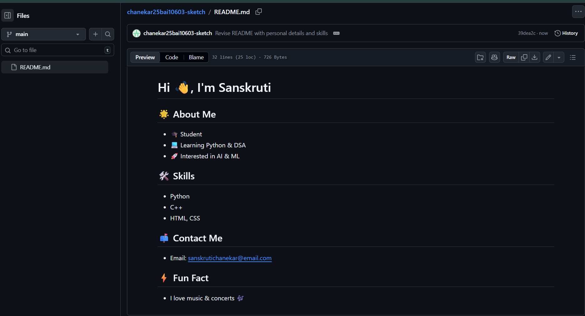
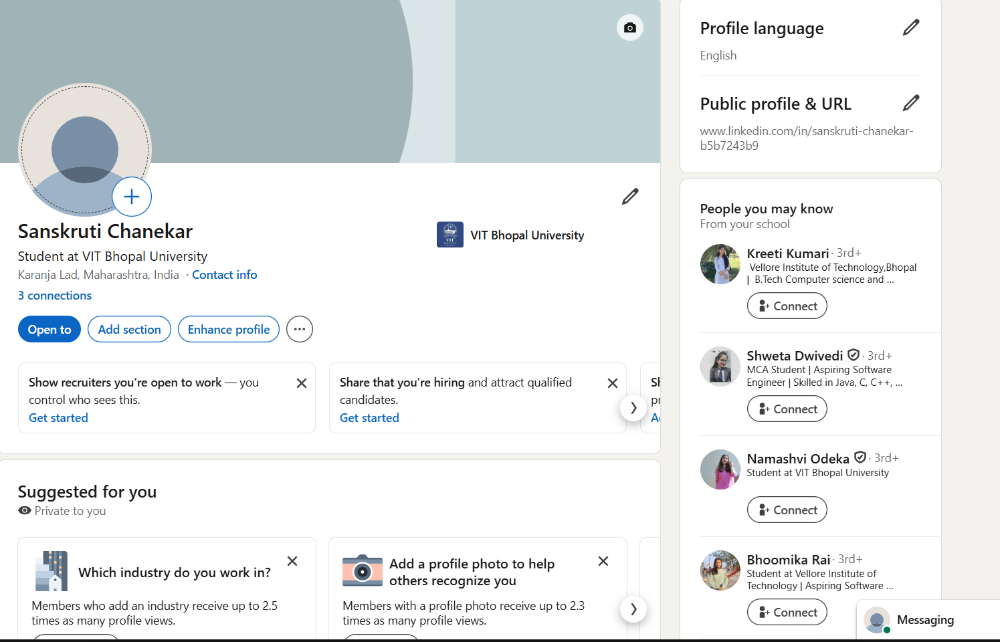
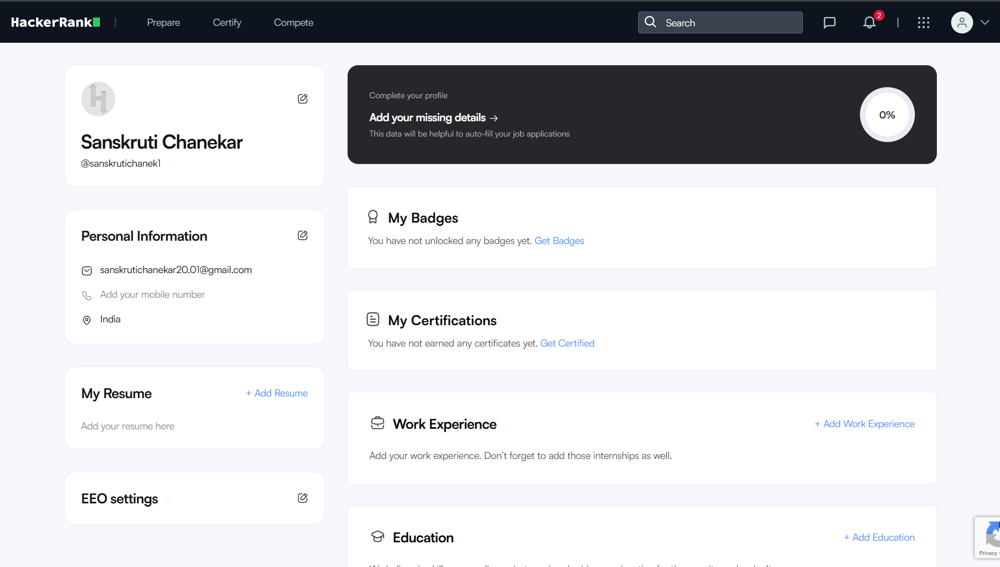
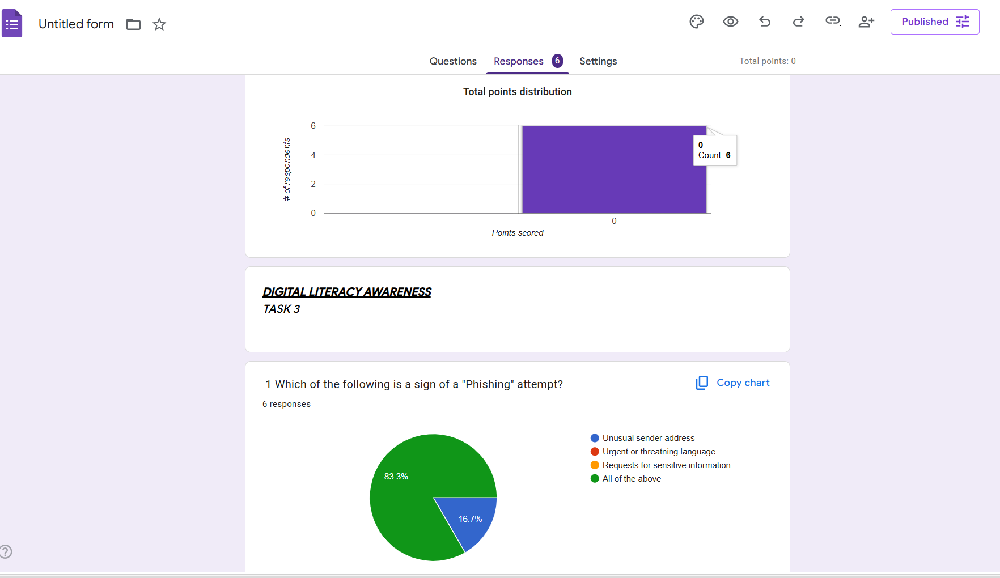
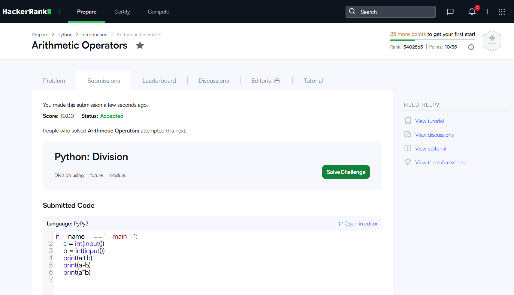
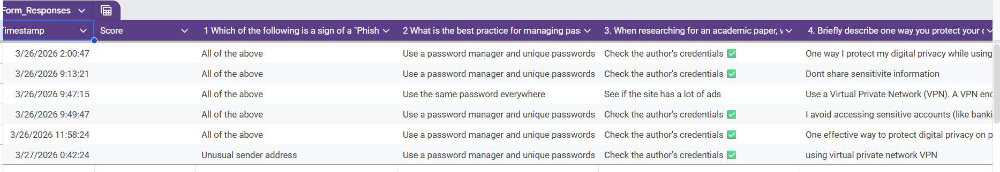

 DIGITAL-LITERACY-AWARENESS# Digital Literacy Project

👩‍🎓 Student Details
- Name: Sanskruti Chanekar
- REG NO: 25BAI10603
- Course: CSE0001 – Digital Literacy
- University: VIT Bhopal
- Year: 1st Year B.Tech

---

 📌 Project Overview
This project is created as part of the Digital Literacy course. It focuses on developing essential digital skills such as online communication, cybersecurity awareness, and professional digital presence. The project includes five tasks that demonstrate practical knowledge of digital tools and platforms.

---

 📂 Tasks Summary

### Task 1: Digital Literacy Infographic
Created an infographic using Canva covering:
- Digital literacy basics
- Safe internet practices
- Professional online presence

📁 Folder: 

### 🔹 Task 2: Student Digital Portfolio

#### GitHub Profile

#### Linkdin Profile

#### HackerRank Profile

### 🔹 Task 3: Coding & Collaboration Platforms

#### Google Form (Digital Literacy Awareness Quiz)

🔗 Google Form Link: https://docs.google.com/forms/d/e/1FAIpQLScAtSnPZpOcTdsdvsy-LZFiPhHypHYW1soDgECucDytTGFwGQ/viewform?usp=publish-editor

#### HackerRank challenge
 

#### Spreadsheet

Task 4: Email ettiquete:
-Drafted two proffessional emails 

i.Assignment extention request 
ii. Internship application 
-created social media DO's and DONT's checklist.

 🔹 Task 5: Cybercrime Awareness
- Created a Cyberbullying case study
- Designed a prevention checklist

---

